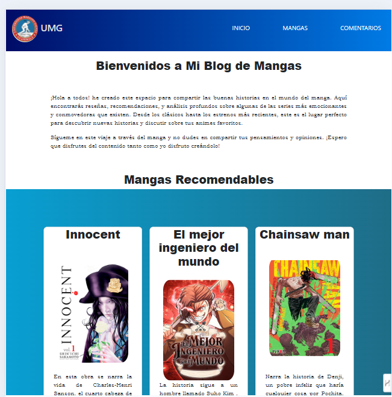

# MateriaQuery
Es mi pagina web con MateriaQuery

En mi enfoque en el diseño responsivo, estuve allí experimentando e incluso corrigiendo. Las media queries asegura que el contenido se vea bien y sea fácil de usar, ya sea en una computadora de escritorio, una tableta o un movil. Aunque manejar las media queries fue un desafío debido a los ajustes necesarios, al final lo logré, y quede satisfecha con el resultado.

Dispositivos móviles:
 

 

 

 
tabletas:
 

 

escritorio

Para que lo vea con más detalle aquí le presento un link:
https://mangasfavoritos.netlify.app
